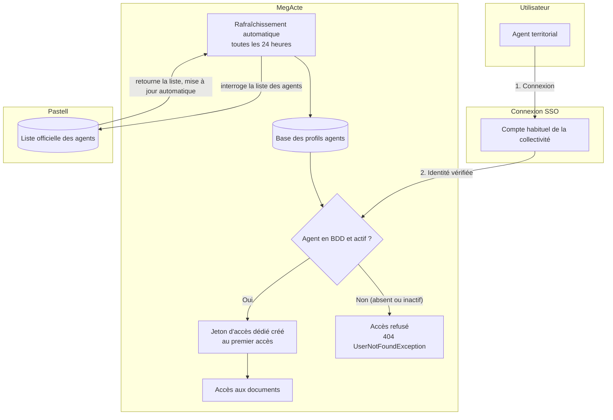
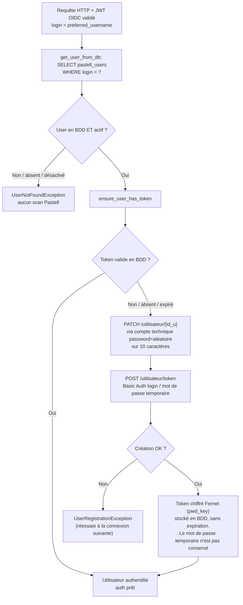

# Enrôlement des utilisateurs Pastell (auto-provisioning)

## Vue d'ensemble

### Points importants

Un agent se connecte à MegActe avec **son compte habituel** (SSO).

- **L'enrôlement passe par la synchronisation de fond uniquement** : MegActe
  rafraîchit automatiquement (toutes les 24 h) la liste des agents depuis Pastell.
  Pas de saisie manuelle.
- **Au premier accès**, si le profil de l'agent est déjà présent en BDD (déjà
  synchronisé), un jeton d'accès dédié lui est créé. Pas de nouveau mot de passe à retenir.
- **Un agent absent de la BDD ou désactivé se voit refuser l'accès**
  (`UserNotFoundException`) jusqu'à la prochaine synchronisation : aucun scan Pastell
  n'est déclenché à la connexion.

## Flux de connexion détaillé

Flux déclenché à chaque appel authentifié : le JWT Keycloak est validé, `preferred_username` sert de login Pastell, puis `get_user_from_db` (`app/database.py`) résout l'utilisateur local.

## Synchronisation de fond

La synchro (démarrage + job périodique `settings.sync.interval_minutes`, + endpoint `POST /users/refresh` réservé aux comptes possédant le rôle admin Keycloak — utilisateur ou service account) est le **seul** mécanisme d'enrôlement : elle remplit la table `pastell_users` à l'avance pour que les logins soient présents à la connexion. Pour chaque entité, liste des utilisateurs → upsert des lignes locales + désactivation des absents.

## Points clés

- **Token partout** : tous les appels vers Pastell passent par un token Bearer — les appels utilisateur (`build_user_auth`, token stocké en base) comme les appels du compte technique admin (`settings.pastell.token`). Aucun login/mot de passe, et la colonne `pwd_pastell` a été supprimée (migration « drop pwd_pastell »). Le champ `user` de la config n'est plus qu'indicatif.
- **Création du token (seule exception)** : à la première connexion (aucun token configuré), le mot de passe Pastell est réinitialisé via le compte technique (`PATCH /v2/utilisateur/{id_u}`). Le token est ensuite créé via l'endpoint self-service `POST /v2/utilisateur/token` en Basic Auth avec le login / mot de passe temporaire — la seule utilisation du login/mot de passe d'un utilisateur (la création par le compte admin `POST /utilisateur/{id_u}/token` ne fonctionne pas pour les utilisateurs qui ne sont pas de type `api`).
- **Clé Fernet** : le token est chiffré avec `pwd_key` du user (générée à l'enrôlement ou à la création manuelle si absente).
- **Sanity check sync** : si une entité échoue pendant le scan, la synchro est abandonnée (pas de commit) pour ne pas désactiver à tort des utilisateurs d'entités non scannées.