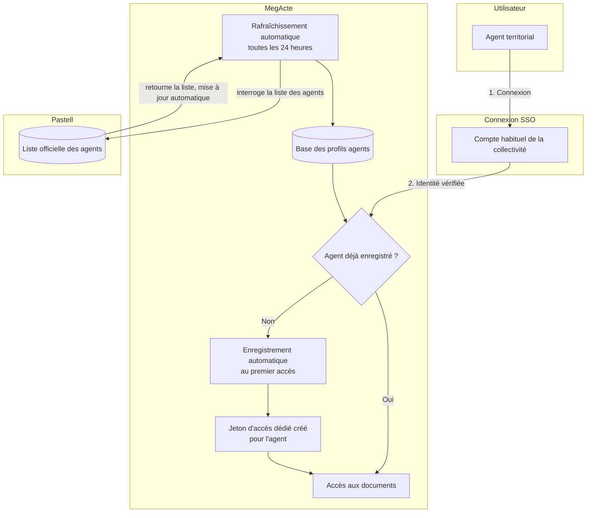
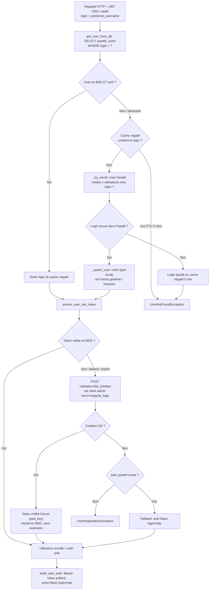

# Enrôlement des utilisateurs Pastell (auto-provisioning)

## Vue d'ensemble

### Points importants

Un agent se connecte à MegActe avec **son compte habituel** (SSO).
MegActe gère l'autoprovisionning, sans intervention / configuration supplémentaire :

- **En arrière-plan, MegActe rafraîchit automatiquement** (toutes les 24 h) la liste
  des agents depuis Pastell. Pas de saisie manuelle.
- **Au premier accès**, le profil de l'agent est créé automatiquement dans MegActe
  et un jeton d'accès dédié lui est attribué. Pas de nouveau mot de passe à retenir.
- Ensuite, l'agent **accède directement à ses documents**.

## Algorithme d'enrollment détaillé (premier login)

Flux déclenché à chaque appel authentifié : le JWT Keycloak est validé, `preferred_username` sert de login Pastell, puis `get_user_from_db` (`app/database.py`) résout l'utilisateur local avec enrôlement progressif si nécessaire.

## Synchronisation de fond

La synchro (démarrage + job périodique `settings.sync.interval_minutes`, + endpoint `POST /users/refresh` réservé à l'admin) remplit la table `pastell_users` à l'avance : pour chaque entité, liste des utilisateurs → upsert des lignes locales + désactivation des absents. L'enrollment lazy ne sert donc que de filet de sécurité pour les logins non encore synchronisés.

## Points clés

- **Token prioritaire** : `build_user_auth` privilégie le Bearer token ; le login/mot de passe n'est qu'un fallback (si la création de token échoue et qu'un mot de passe existe).
- **Cache négatif** : un login absent (ni en BDD, ni dans Pastell) n'est re-scanné que toutes les 5 minutes max (TTL), sinon le scan Pastell serait trop coûteux.
- **Clé Fernet** : le token est chiffré avec `pwd_key` du user (générée à l'enrôlement si absente) ; `pwd_key` sert aussi au mot de passe.
- **Sanity check sync** : si une entité échoue pendant le scan, la synchro est abandonnée (pas de commit) pour ne pas désactiver à tort des utilisateurs d'entités non scannées.

