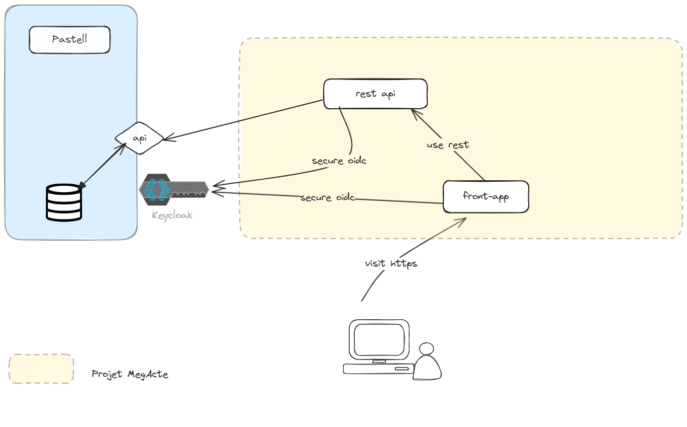

# Architecture

## Composants

* Backend en Python (dossier [back](../back/README.md))
* Frontend (dossier [web-app](../web-app/README.md))

## Schéma d'architecture globale

## Sécurité

La gestion des accès à l'application se fait en deux temps.

1. [Sécurisation OIDC](#oidc)
2. [Gestion du profil utilisateur via les rôles Pastell](#gestion-du-profil-utilisateur)

### OIDC
La web-app et les api Rest sont soumis à authentification auprès d'une IAM compatible OIDC (exemple [keycloak](https://www.keycloak.org/))
